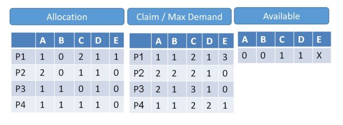
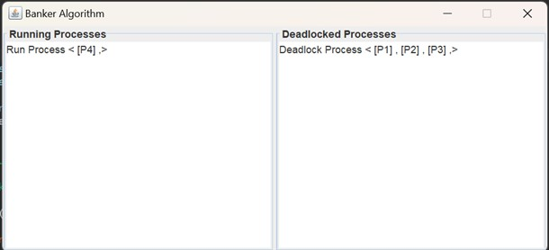

# Banker Algorithm - Javier Giberg 
 ## import
 ## javax.swing
 ## java.awt
 ## java.util.HashMap
 ## java.util.concurrent.Semaphore)
 
 ### 1 file main ADT code without frame interface
 
 ### 2 flie HomeFrame swing interface

 ### The matrices must contain these details A B C D E  

 ### All the parameters must be entered, the code without handling exceptions!!
 
 
 
 ### X = 1 --> Output:
 

 
 
